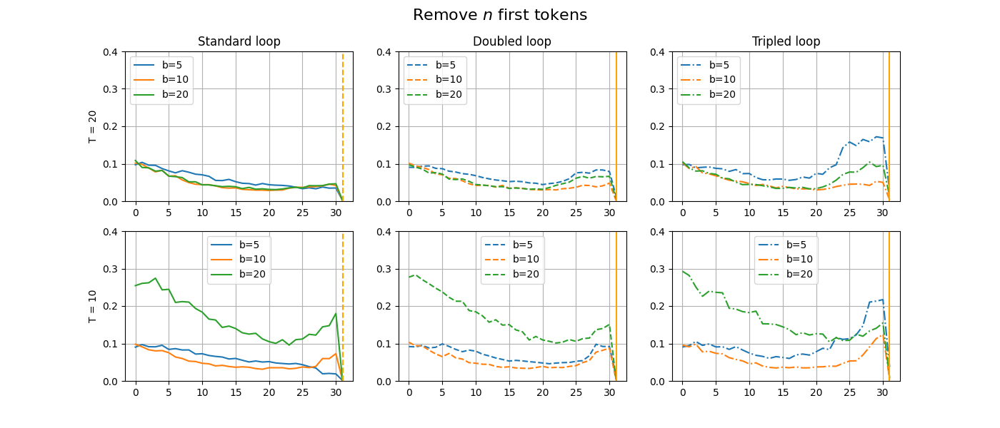
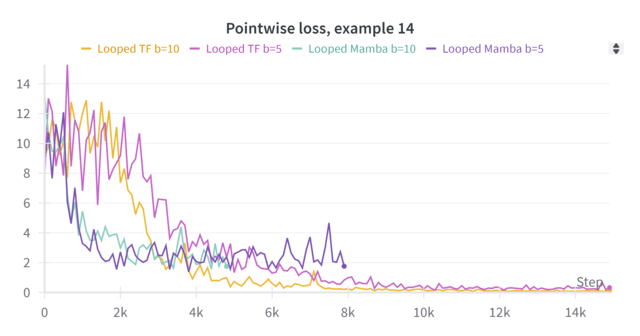
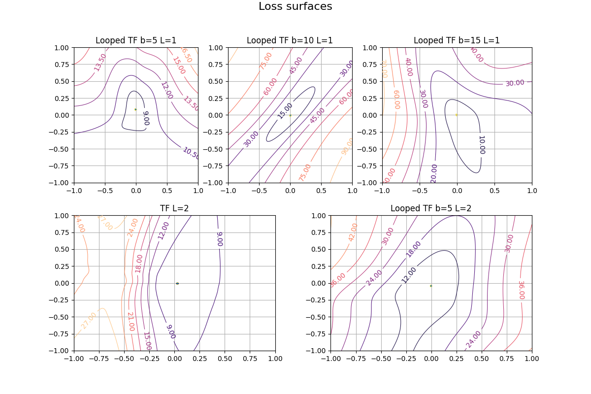

## Отчет по исследованию Looped Transformers и их возможностей.
Мини исследование-отчет по статье - https://arxiv.org/abs/2311.12424

## Оглавление
- [Введение](#introducion)
- [Сравнение эффективности Looped TFs с обычными TFs](#basic-comparision)
- - [Итеративные свойства](#basic-comparision-iter-props)
- - [Дополнительно](#basic-comparision-additional)
- [N токенов](#n-tokens)
- - [Попробуем брать N последних токенов](#n-last-tokens)
- - [Попробуем брать N первых токенов](#n-first-tokens)
- - [Дополнение](#n-tokens-additive)
- [Looped n-layers](#looped-n-layers)
- - [Основной эксперимент](#looped-n-layers-exp)
- - [Сходимость на этапе тренировки](#looped-n-layers-convergence)
- [Заменим Attention на SSM](#ssm)
- - [Постановка задачи](#ssm-start)
- - [Mamba](#ssm-mamba)
- - [Послесловие](#ssm-mamba-afterword)
- [Немного изменим модель (Bonus)](#lr)
- [Дополнительные наблюдения](#additive)
- [Дискуссия и заключение](#conclusion)

## Установка среды

Все использованные версии библиотек содержатся в `environment.yml`. Для установки среды можно воспользоваться следующими командами:
```commandline
conda env create -f environment.yml
conda activate looped_tf
```

В случае трудностей с тренировкой модели все веса находятся по пути `/scripts/scripts/models`.

<a id="introducion"></a>
## Введение
За основу исследования взята статья **Looped Transformers are Better at Learning Learning Algorithms**. В данной работе мы посмотрим на возможности по улучшению модели, скорости ее сходимости, проверим несколько гипотез и попробуем обосновать полученный результат. Выведем метрики для сравнения архитектур при различных параметрах и посмотрим, что влияет на тот или иной результат. Б<em>о</em>льшая часть экспериментов проводилась с параметрами $d={10}$ и количеством точек $k={31, 41}$. Список модификаций исходного репозитория приведен в конце.

Одна часть экспериментов проводилась в ноутбуках формата `experiment_*.ipynb`. Другая часть экспериментов проводилась в удаленной среде (kaggle), их конфигурации находятся в папке `configs`.

Задача работы: сравнить возможность зацикленных и обычных моделей для **In-Context Learning** в контексте линейной регрессии (с шумом и без). 

<a id="basic-comparision"></a>
## Сравнение эффективности Looped TFs с обычными TFs
Все эксперементы проводились с выключенным Mixed Precision, поскольку он не влиял на скорость обучения - из-за того, что gpt2_nano не может использовать GPU эффективно, и по этой же причине, тренировка оставалась относительно медленной.
Одна часть эксперементов проводилась на локальной машине с Nvidia 3060ti mobile, а вторая на удаленной машине.

Для сравнения двух типов моделей, посмотрим на скорость сходимости трансформера (TF) с параметром $L = 12$ и Looped TFs с параметрами $L = 1; b = \{5, 10, 20, 25\}; T= \{10, 20\}$. Были использованы следующие параметры `Heads=4, dims=10, points=31`. На графике квадратичная ошибка масштабирована на размерность регрессии $loss_{scaled} = \frac{loss}{d}$.

|                                                  |                                             |
|--------------------------------------------------|---------------------------------------------|
|  |  |

Как можно видеть из графиков, Looped TFs при увеличении $ b $ дает улучшение метрик. 
При количестве параметров в 12 раз меньшим, чем у обычного трансформера, он показывает сопоставимые с обычным трансформером показатели. 

<a id="basic-comparision-iter-props"></a>
### Итеративные свойства
Сравним точность моделей и посмотрим на их поведение на разных итерациях (в дальнейшем данный метод будет использован ни один раз). Для этого обучим Looped TFs со значениями $b=\{5, 10, 20\}; T={ 20, 10}$  и посмотрим на их сходимость при больших $b$.

|           |       |
|-----------|-------|
|     |  |

Из графика можем видеть, что при большем $b$ Looped TF показывает себя лучше и результаты модели становятся более стабильными.  
Эксперименты проводились в блокноте `experiment_schedule.ipynb`. 

<a id="basic-comparision-additional"></a>
### Дополнительно
Появилась следующая гипотеза:

>**Гипотеза**
>
>Тренировка с использованием шедулинга (по параметру $b$) может дать лучшую сходимость при увеличении параметрa $b$ на этапе валидации. 

Однако в процессе эксперимента со слабыми моделями (`n_embs=128`), это подтвердилось только частично. 
При тренировке с разным $b$, на большем количестве итераций при $T=20$ модель дает меньшую ошибку. Однако при $T=10$ данное правило не выполняется.  
Опыты проводились в блокноте `experiment_shedule.ipynb` и в блокноте `experiment_shedule_2.ipynb`.

|           |                                                                                            | |
|-----------|--------------------------------------------------------------------------------------------|-|
|     |      |   |

Из графиков выше можно видеть, что, в отличии от моделей с параметрами $b=5; b=10; b=15$, у модели с варьированием $b=5-10; b=5-15$ на этапе валидации показатели точности сильно разнятся. Также были протестированы модели с размерностью `n_embs=256` - мы увеличили размерность моделей в два раза относительно предыдущих, однако это не изменинило положения. Возможно, данные результаты связаны с тем, что модель пытается подстроиться под разное количество итераций во время обучения.

<a id="n-tokens"></a>
## N токенов
Проверим гипотезу:

> ***Гипотеза***
>
> Модель имеет возможность использовать часть токенов как хранилище информации с предыдущего шага.

Постановка экспериментов. Будем убирать как $n$-первых, так и $n$-последних токенов на отдельно обученных моделях с разным $T$. Графики будем строить следующим образом: по оси абсцисс - количество используемых токенов, а по оси ординат - квадратичная ошибка.

<a id="n-last-tokens"></a>
### Попробуем брать N последних токенов
Чтобы понять, насколько мы можем обрезать количество токенов,  которые подаются в модель, замаскируем часть из них, и посмотрим на метрики.
Модели обучались с параметрами $b = \{5, 10, 20\}; T = \{10, 20\}$ при количестве шагов равным 20000. 

На графиках ниже мы можем видеть вполне ожидаемый результат - для моделей обученных с параметрами $b = \{5, 10, 20\}; T = \{10, 20\}$ точность ухудшается вместе с уменьшением количества токенов, поступающих на вход.


Также интересно, что при увеличении количества итераций при инференсе мы получаем такую же ошибку на каждом этапе отбрасывания $n$ токенов.
Можно сделать вывод, что ограничение количества подаваемых с конца токенов сильно влияет на качество. Но что если брать $n$ первых токенов?

<a id="n-first-tokens"></a>
### Попробуем брать N первых токенов
Попробуем замаскировать все токены кроме $n$ первых и посмотрим на метрики моделей.



Как можем видеть, ощутимой разницы это не дало, видимо для зацикленных трансформеров первые и последние токены имеют схожую важность. 
Меньшее количество токенов негативно влияет на итоговые показатели модели. Можно сделать вывод что исходная гипотеза верна, дополнительные
токены на входе действительно позволяют модели обучаться для хранения информации о токенах с предыдущей итерации. 
Эксперименты проводились в блокнотах `experiment_last_n_tokens.ipynb` и `experiment_first_n_tokens.ipynb`.


<a id="n-tokens-additive"></a>
### Дополнение
В результате проведения экспериментов проявилось интересное поведение которое потенциально может вести к переобучению модели, и иногда отсутствию возможности адаптироваться на новые данные. При использовании 20-30 токенов мы на обоих графиках можем наблюдать уменьшение точности, и на последней точке перед скачком резкое увеличение точности. Данное поведние стоит исследовать на разной размерности, количестве токенов и других задачах классификации (дерево, MLP, ... ).

Также при маскировании $n$ токенов на этапе обучания алгоритм сходился значительно медленнее или чаще всего не сходился вовсе. Возможно, стоит изменить подход к маскированию и посмотреть, как модель будет обучаться, если какой-то процент данных зашумлен.

<a id="looped-n-layers"></a>
## Looped n-layers
Проверим возможности зацикленных трансформеров 
при обучении с количеством слоев $L > 1$.

<a id="looped-n-layers-exp"></a>
### Основной эксперимент
Будем обучать зацикленные трансформеры с варьированием $b, L, T$. На графике ниже можем видеть, что увеличение количества слоев у модели дает лучшую точность c фиксированной запятой при увеличенном количестве итераций.


Данный паттерн повторяется с разным параметром $T$ и при 
разной (случайной) инициализации весов. Предположение состоит в том, что при увеличенном $L$ внутри модели появляются более сложные зависимости. Этим может объясняться как более долгая сходимость на этапе тренировки, так и лучшие значения во время валидации модели.

<a id="looped-n-layers-convergence"></a>
### Сходимость на этапе тренировки
Из интересного стоит отметить, что, чем больше слоев у модели, тем больше шагов итерации ей необходимо чтобы сойтись. К примеру, для моделей с параметрами $b=10; L=1$ среднеквадратичная ошибка начинает убывать быстрее к минимальному наблюдаемому результату. Также выход на плато достигается быстрее при $L=2$ и сильно быстрее, чем у $L=4$. 
Результаты изображены на графике ниже:

|                                                  |                                             |
|--------------------------------------------------|---------------------------------------------|
|  |  |


Получается, что сходимость зависит не только от числа итераций 
$b$, но и от числа слоев $L$. Результаты были получены при
разном параметре $T$.

Эксперимент проводился в блокноте 
`experiment_looped_n_layers.ipynb`.

<a id="ssm"></a>
## Заменим Attention на SSM

<a id="ssm-start"></a>
### Постановка задачи
В данной серии эксперементов попробуем исследовать как ведет себя **Mamba** (архитектура из статьи [**Transformers are SSMs: Generalized Models and Efficient Algorithms Through Structured State Space Duality**](https://arxiv.org/pdf/2405.21060) ). Реализация взята из библиотеки `zetascale` и репозитория [**mamba-minimal**](https://github.com/johnma2006/mamba-minimal). Стоит заметить, что время обучения модели сильно больше в отличие стандартного блока трансформера, поскольку там не реализованы многие методы оптимизации. Вместо стандартного диапазона тренировки $8 min - 20 min$ обучение модели занимает $1 h - 8 h$.

Проверим следующую гипотезу:

> ***Гипотеза***
>
> Поведение моделей будет похоже как при тренировке, так и при валидации.


<a id="ssm-mamba"></a>
### Mamba
Для построения модели заменим основную модель **GPT-nano** на архитектуру **Mamba**. Сама реализация находится в `mamba_nano.py`. Была обучена базовая модель с разным количеством итераций. Разное количество шагов вызвано большим временем обучения модели, однако мы все равно можем проследить основные моменты, такие как выход на плато и начало падения целевой метрики. Результаты обучения приведены на графике ниже. Для более наглядного сравнения использовалось скользящее среднее. 


Как мы можем увидеть модель, проявляет себя достаточно интересно - на первых итерациях квадратичная ошибка падает сильно быстрее, чем у Looped TF, и далее идет выход на плато, но несмотря на эти показатели, итоговая ошибка у моделей на базе архитектуры **Mamba** больше, чем у моделей на базе трансформеров. Посмотрев на график ниже, можно предположить, что **Mamba** накапливает больше ошибок в процессе выполнения (по сравнению с трансформером, который становится более стабильным). 



Интересно, что зацикленная **Mamba** показывает себя стабильнее на большем количестве итераций при валидации. Основная гипотеза состоит в том, что сама архитектура модели более натурально работает в цикле. Поскольку **Mamba** это sequence-based network, в теории она может более натурально работать с циклами, однако этот тезис стоит проверить основательнее, на других эксперименетах.


<a id="ssm-mamba-afterword"></a>
### Послесловие
Для конечных выводов по использованию данной архитектуры и ее возможностей с зацикливанием стоит провести больше эксперементов. Но ввиду сильного увеличения времени работы, сделать это тяжело, не прибегая к тем улучшениям (одна из самых важных частей статьи), которые делают модели **Mamba** быстрее при увеличении контекста. Однако, изначальная гипотеза не подтвердилась - модель показала себя слабее относительно трансформеров, однако возможный тюнинг параметров может помочь модели достигнуть похожих показателей точности. И хотя модель достигает меньшей точности по сравнению с трансформерами, можно увидеть, что ее зацикленная версия ведет себя значительно лучше, а это значит, что и с другими архитектурами их зацикленные версии могут дать значительный прирост в точности.

<a id="lr"></a>
## Немного изменим модель
Одним из основых элементов архитектуры модели является цикл с находящимся внутри трансформером. Так как мы стараемся имитировать итеративные алгоритмы, попробуем позаимствовать идею из градиентного спуска. Дадим модели новый параметр $lr \in \mathbb{R}$, который будет обучаться вместе с моделью. Будем каждую итерацию цикла умножать исходные ембединги на `lr`. 
Обучим для более справедливого оценивания несколько моделей с параметрами $b=\{5, 10, 15\}$ и модели без модификации на этих же конфигурациях. 


В результате мы получили более точную модель. При больших итерациях, за исключением шедулинга, где результат идентичен, мы можем видеть, что дополнительная информация о цикле помогает уменьшить ошибку после обучения. Разница в квадратичной ошибке составляет ~0.005, ~0.005, ~0.0024 для $b = \{5, 10, 15\}$ соответственно. 

|               | b=5    | b=10   | b=15    |
|---------------|--------|--------|---------|
| Classic model | 0.0067 | 0.0070 | 0.00328 |
| LR model      | 0.0014 | 0.0019 | 0.00086 |

Посмотрим на график обучения модели и на скользящее среднее во время тренировки. Можем увидеть что наше дополнение к архитектуре позволяет ускорить сходимость алгоритма.


Эксперимент проводился в блокноте `experiment_bonus.ipynb`.


<a id="additive"></a>
## Дополнительные наблюдения
Поскольку Looped TFs имеют преимущество во многих ситуациях над обычными TF с таким же или б<em>о</em>льшим количеством параметров, исследование этого поведения может помочь в понимании природы такого поведения. Как один из вариантов, можно посмотреть на ландшафт потерь моделей и посмотреть на их различия. Метод взят из статьи [**Visualizing the Loss Landscape of Neural Nets**](https://arxiv.org/pdf/1712.09913). 

Было обучено 5 моделей - один зацикленный трансформер со значениями $b = \{5, 10, 15\}; L= 1$, еще один со значениями $b = 5; L= 2$ и обычный трансформер со значением $L=\{2\}$. Трансформер с одним слоем не использовался ввиду несходимости на задаче линейной регрессии. Графики ландшафтов можно увидеть ниже.


Можно увидеть, что у Looped TF ландшафт потерь более равномерный, чем у обычного трансформера. Также в ряде случаев ландшафт имеет более крутые спуски в окрестности точки минимума, что может свидетельствовать о более скорой сходимости. Это же мы можем видеть на графиках обучения модели. Хотя по графикам нельзя однозначно говорить, что влияет на такое хорошее поведение у Looped TF, но позволяет дать некоторые идеи относительно того, что может происходить при обучении модели.

Все эксперименты проводились в ноутбуке `loss_surface.ipynb`, 3д графики можно увидеть там же или в папке `images`. 


<a id="conclusion"></a>
## Дискуссия и заключение
Мы провели ряд эксперементов с Looped TF и TF, варьировали их параметры и попытались интерпертировать вывод модели. Можно сказать, что зацикленные трансформеры показали свою эффективность в задачах линейной регрессии. Многие выводы, сделанные в оригинальной статье, подтвердились. 
Было выяснено, что при увеличении числа слоев модели вели себя ожидаемо, улучшая итоговое качество метрик, однако если слоев становилось слишком много, модель сходилась сильно дольше (особенно при увеличении $b$). Чтобы это исправить, можно попробовать изменить архитектуру модели, добавить внутренний шедулинг, чтобы динамически изменять параметр $b$ на этапе инференса модели, или же вовсе выбирать количество итераций динамически. 

Чтобы улучшить обобщающие способности модели, можно провести больше экспериментов с варьированием $b$ на этапе тренировки, это может привести к улучшению результата.

Архитектура *Mamba* и ее "*Looped*" версия показала себя многообещающе, и хотя не получилось провести все необходимые эксперименты, ввиду долгого времени тренировки, она показала себя достаточно хорошо, чтобы исследовать на ней задачу **In-Context learning** в контексте моделей Universal Transformer.

Сама же интерпретация моделей вызывает большой интерес. Стоит более внимательно изучить поведение моделей как итеративного алгоритма в задаче **In-Context learning** для более сложных задач, таких как языковое моделирование (LM) или же компьютерное зрение (CV).
