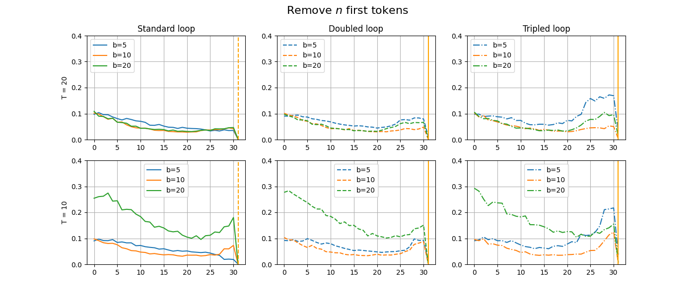
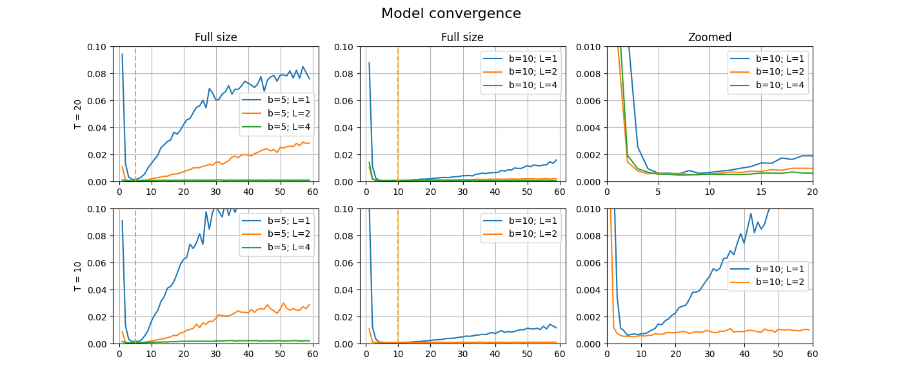

## Отчет по исследованию Looped Transformers и их возможностей.
Мини исследование-отчет по статье - https://arxiv.org/abs/2311.12424

## Оглавление
- [Введение](#introducion)
- [Сравнение эффективности Looped TFs с обычными TFs](#basic-comparision)
- - [Итеративные свойства](#basic-comparision-iter-props)
- - [Дополнительно](#basic-comparision-additional)
- [N токенов](#n-tokens)
- - [Попробуем брать N последних токенов](#n-last-tokens)
- - [Попробуем брать N первых токенов](#n-first-tokens)
- - [Дополнение](#n-tokens-additive)
- [Looped n-layers](#looped-n-layers)

## Введение
За основу исследования взята статья **Looped Transformers are Better at Learning Learning Algorithms**. В данной работе мы запустим часть эксперементов для проверки возможностей по улучшению модели, скорости ее сходимости. Выведем графики для сравнения архитектур при различных параметрах. И попробуем интерпретировать вывод модели при разных параметрах. Б<em>о</em>льшая часть эксперементов проводилась с параметром $ b=10 $ и количеством точек $k={31, 41}$. Список модификаций исходного репозитория приведен в конце.

Часть экспериментов проводилась в ноутбуках формата `experiment_*.ipynb` и конфигурации для проведения эксперементов в удаленной среде (kaggle) находятся в папке `configs`. Наша целевая функция - $MSE$. 

Задача работы: сравнить возможность зацикленных и обычных моделей для **In-Context Learning** в контексте линейной регрессии.

## Сравнение эффективности Looped TFs с обычными TFs
Все эксперементы проводились с выключенным Mixed Precision, по скольку он не влиял на скорость обучения - видимо из-за того что gpt2_nano не может использовать GPU эффективно.
Одна часть эксперементов проводилась на локальной машине с Nvidia 3060ti mobile, а вторая на удаленной машине с Nvidia Tesla P100.

Посмотрим на скорость сходимости трансформера (TF) с параметром $L = 12$ и Looped TFs с параметрами $ L = 1; b = \{5, 10, 20, 25\}; T= \{10, 20\}$. Были использованы следующие параметры Heads=4, dims=10, points=31. Потери масштабированы на размерность регрессии.

|                                                  |                                             |
|--------------------------------------------------|---------------------------------------------|
|  |  |

Как можно видеть из графиков, Looped TFs при увеличении $ b $ дает улучшение метрик. 
При количестве параметров в 12 раз меньшим, чем у обычного трансформера, он показывает неплохие показатели. 
Конфигурации для запуска моделей взяты из папки эксперимента №5.

### Итеративные свойства
??По скольку в статье подразумевается что Looped TFs имеют итеративные свойства, мы можем их проверить на примере линейной регрессии.
?? Для этого обучим Looped TFs со значениями $ b={5, 10, 20}; T={ 20, 10} $  и посмотрим на их сходимость при больших $ b $.

|           |       |
|-----------|-------|
|     |  |

Из графика можем видеть что при большем $ b $ на тренировке Looped TF показывает себя лучше при $ b > 5 $.  
Блокнот `experiment_schedule.ipynb`. 

### Дополнительно
Появилась гипотеза о том, что шедулинг может помочь для обобщающих способностей модели. 
Увеличивая параметр $ b $ во время тренировки можно получить лучшую обобщающую способность, 
однако в процессе эксперимента со слабыми моделями это подтвердилось только частично. 
При тренировке с разным $ b $, модель дает меньшую ошибку на большем количестве итераций при $ T=20 $, 
однако при $ T=10 $ утверждать то же не можем.  
Опыты проводились в блокноте `experiment_shedule.ipynb` и в блокноте `experiment_shedule_2.ipynb`.

|           |                                                                                            |
|-----------|--------------------------------------------------------------------------------------------|
|     |      |

Из графика можно видеть, что в отличии от моделей с параметрами $ b=5; b=10; b=15 $, у модели с варьированием $ b $ на этапе тренировки показатели точности сильно разнятся. 

## N токенов
Проверим гипотезу

> ***Гипотеза***
>
> В таком случае, модель имеет возможность использовать часть токенов как хранилище информации с предыдущего шага.

Постановка экспериментов. Будем убирать как $n$-первых так и $n$-последних токенов на отдельно обученных моделях с разным $T$.
По оси абсцисс - количество используемых токенов, а по оси ординат - квадратичная ошибка.

### Попробуем брать N последних токенов
Чтобы понять на сколько мы можем обрезать количество токенов которые подаются модель замаскируем часть из них и посмотрим на метрики.
Модели обучались с параметрами $ b = {5, 10, 20}; T = {10, 20} $ при количестве шагов равным 20000. 

На графиках ниже мы можем видеть вполне ожидаемый результат, для моделей с $ b = \{5, 10, 20\} $ обученных с параметром $ T = \{10, 20\}$ точность ухудшается вместе с уменьшением количества токенов поступающих на вход.

Также интересно, что при увеличении количества итераций при инференсе мы получаем такую же ошибку на каждом этапе отбрасывания $ n $ токенов.
Можно сделать вывод что использование последних $ n $ токенов сильно влияет на качество, но что если брать $ n $ первых токенов?

### Попробуем брать N первых токенов
Попробуем маскировать все токены кроме $ n $ первых и посмотрим на метрики модели.

Как можем видеть ощутимой разницы это не дало, видимо для зацикленных трансформеров первые и последние токены имеют схожую важность. 
Меньшее количество токенов негативно влияет на итоговые показатели модели. 
Эксперименты проводились в блокнотах `experiment_last_n_tokens.ipynb` и `experiment_first_n_tokens.ipynb`.

Можно сделать вывод что исходная гипотеза верна, дополнительные
токены на входе действительно могут позволять модели обучаться для хранения информации о токенах с предыдущей итерации. 

### Дополнение
В результате проведения экспериментов проявилось интересное поведение, которое потенциально может вести к переобучению модели и иногда отсутствию возможности адаптироваться на новые данные. При использовании 20-30 токенов мы на обоих графиках можем наблюдать уменьшение точности и на последней точке перед скачком резкое  увеличение точности. Данное поведние стоит исследовать на разной размерности, количестве токенов и других задачах классификации (дерево, MLP, ... ).

Также при убирании $n$ токенов на этапе обучания алгоритм сходился значительно медленнее или чаще всего не сходился вовсе. Возможно стоит изменить подход к маскированию и посмотреть как модель будет обучаться если какой-то процент данных зашумлен.

## Looped n-layers.
Проверим возможности зацикленных трансформеров 
при обучении с количеством слоев $ L > 1 $. Будем обучать
зацикленные трансформеры с вариьрованием 
$b, L, T$. 
На графике ниже можем видеть, что увеличение количества
слоев у модели дает лучшую фиксированную точность 
после запятой при увеличенном количестве итераций.

Данный паттерн повторяется с разным параметром $T$ и при 
разной (случайной) инициализации весов. Предположение состоит в том, что при увеличенном $L$ у модели б<em>о</em>льшая обобщающая способность этим может объясняться как более долгая сходимость на этапе тренировки, так и лучшие значения во время валидации модели.

### Сходимость на этапе тренировки
Из интересного, стоит отметить, что, чем больше слоев у модели, тем больше шагов итерации ей необходимо чтобы сойтись. К примеру для моделей где $b=10$ и $L=1$ среднеквадратичная ошибка начинает убывать быстрее к минимальному наблюдаемому результату и выход на плато достигается тоже быстрее чем при $L=2$ и сильно быстрее чем у $L=4$. 
Результаты изображены на графике ниже:

|                                                  |                                             |
|--------------------------------------------------|---------------------------------------------|
|  |  |

Получается, что сходимость зависит не только от числа итераций 
$b$, но и от числа слоев $L$. Результаты были получены при
разном параметре $T$.

Эксперимент проводился в блокноте 
`experiment_looped_n_layers.ipynb`.

## Итоги

## Дополнительные наблюдения

